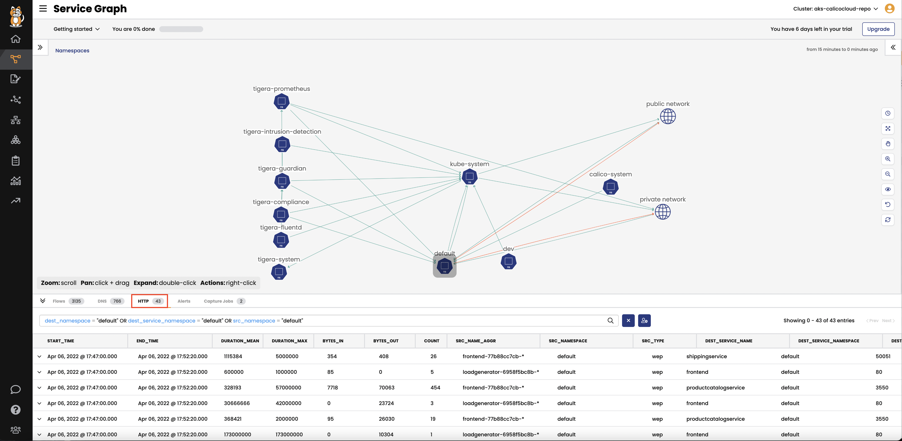

# Module 9: Enabling L7 visibility 

**Goal:** Enable L7/HTTP flow logs in hipstershop with Calico cloud. Calico cloud not only can provide L3 flow logs, but also can provide L7 visibility without service mesh headache. 

**Docs:** https://docs.tigera.io/visibility/elastic/l7/configure)

## Steps


1.  Configure Felix for log data collection and patch Felix with AKS specific parameters

    >Enable the Policy Sync API in Felix - we configure this cluster-wide

    ```bash
    kubectl patch felixconfiguration default --type='merge' -p '{"spec":{"policySyncPathPrefix":"/var/run/nodeagent"}}'
    ```

    ```bash
    kubectl patch installation default --type=merge -p '{"spec": {"kubernetesProvider": "AKS"}}'
    kubectl patch installation default --type=merge -p '{"spec": {"flexVolumePath": "/etc/kubernetes/volumeplugins/"}}'
    ```


2.  Prepare scripts for deploying L7 Log Collector DaemonSet

    ```bash
    DOCS_LOCATION=${DOCS_LOCATION:="https://docs.tigera.io"}

    #Download manifest file for L7 log collector daemonset
    curl ${DOCS_LOCATION}/v3.10/manifests/l7/daemonset/l7-collector-daemonset.yaml -O

    #Download and install Envoy Config
    curl ${DOCS_LOCATION}/v3.10/manifests/l7/daemonset/envoy-config.yaml -O
    ```
3.  Create the Envoy config in `calico-system` namespace
    ```bash
    kubectl create configmap envoy-config -n calico-system --from-file=envoy-config.yaml
    ```

4.  Enable L7 log collection daemonset mode in Felix
    ```bash
    kubectl patch felixconfiguration default --type='merge' -p '{"spec":{"tproxyMode":"Enabled"}}'
    ```

5.  Apply l7-collector-daemonset.yaml and ensure that l7-collector and envoy-proxy containers are in `Running` state. 
    >You can also edit the `LOG_LEVEL` with different options: Trace, Debug, Info, Warning, Error, Fatal and Panic. Enable L7 log collection daemonset mode in Felix by setting Felix configuration variable tproxyMode to Enabled or by setting felix environment variable FELIX_TPROXYMODE to Enabled.

    ```bash
    kubectl apply -f l7-collector-daemonset.yaml
    ```

    >If successfully deployed an `l7-log-collector` pod will be deployed on each node. To verify:
    ```bash
    kubectl get pod -n calico-system
    ```
    >Output will look similar to:
    ```
    NAME                                       READY   STATUS    RESTARTS   AGE
    calico-kube-controllers-6b4dccd6c5-579s8   1/1     Running   0          120m
    calico-node-b26qh                          1/1     Running   0          120m
    calico-node-pl646                          1/1     Running   0          2m2s
    calico-node-rmx2q                          1/1     Running   0          120m
    calico-typha-6f7f966d4-28n9j               1/1     Running   0          122m
    calico-typha-6f7f966d4-8nx5f               1/1     Running   0          2m1s
    calico-typha-6f7f966d4-g7b69               1/1     Running   0          122m
    l7-log-collector-627qf                     2/2     Running   0          91s
    l7-log-collector-6b6cx                     2/2     Running   0          3m52s
    l7-log-collector-jxzjq                     2/2     Running   0          15m
    ```


6. Select traffic for L7 log collection

   ```bash
   #Annotate the services you wish to collect L7 logs as shown. Use hipstershop service as example
   kubectl annotate svc adservice projectcalico.org/l7-logging=true
   kubectl annotate svc cartservice projectcalico.org/l7-logging=true
   kubectl annotate svc checkoutservice projectcalico.org/l7-logging=true
   kubectl annotate svc currencyservice projectcalico.org/l7-logging=true
   kubectl annotate svc emailservice projectcalico.org/l7-logging=true
   kubectl annotate svc frontend projectcalico.org/l7-logging=true
   kubectl annotate svc frontend-external projectcalico.org/l7-logging=true
   kubectl annotate svc paymentservice projectcalico.org/l7-logging=true
   kubectl annotate svc productcatalogservice projectcalico.org/l7-logging=true
   kubectl annotate svc recommendationservice projectcalico.org/l7-logging=true
   kubectl annotate svc redis-cart projectcalico.org/l7-logging=true
   kubectl annotate svc shippingservice projectcalico.org/l7-logging=true
   ```
   
7. *[Optional]* restart the pods of `hipstershop` if you want to see l7 logs right away.    
    >L7 flow logs will require a few minutes to generate, you can also restart pods which will lead l7 logs pop up quicker.  

    ```bash
    kubectl delete pods --all 
    ``` 

  Now view the L7 logs in Kibana by selecting the tigera_secure_ee_l7 index pattern. You should also see the relevant HTTP log from service graph.    

   
   

[Next -> Module 10](../calicocloud/host-end-point.md)

