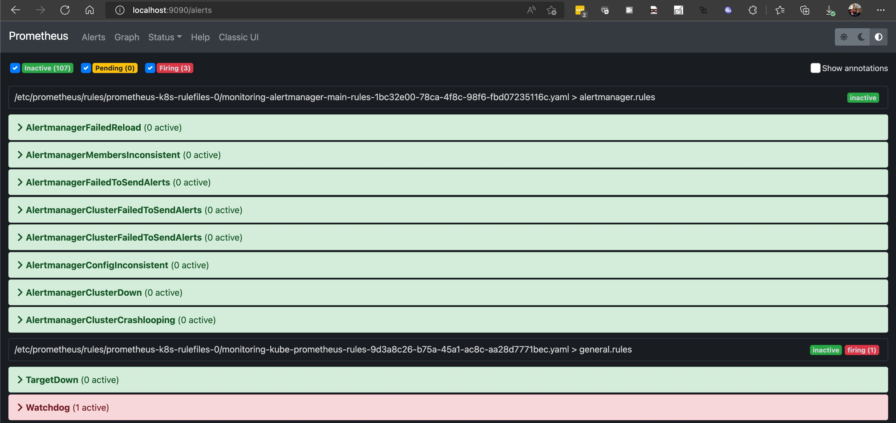
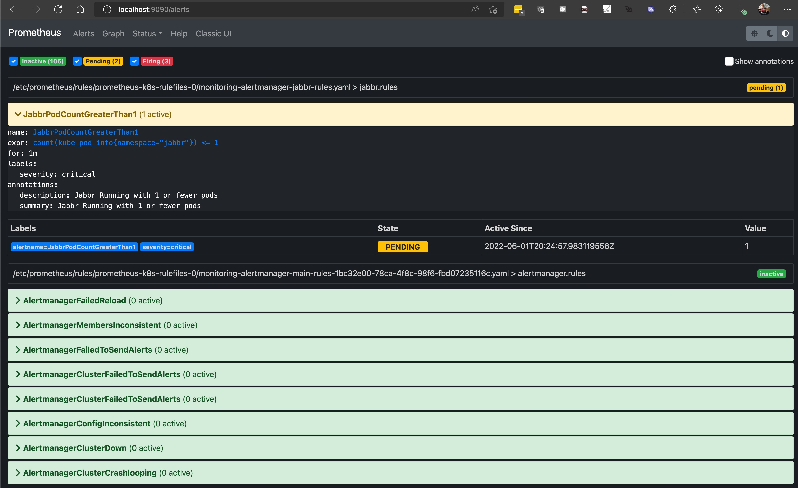
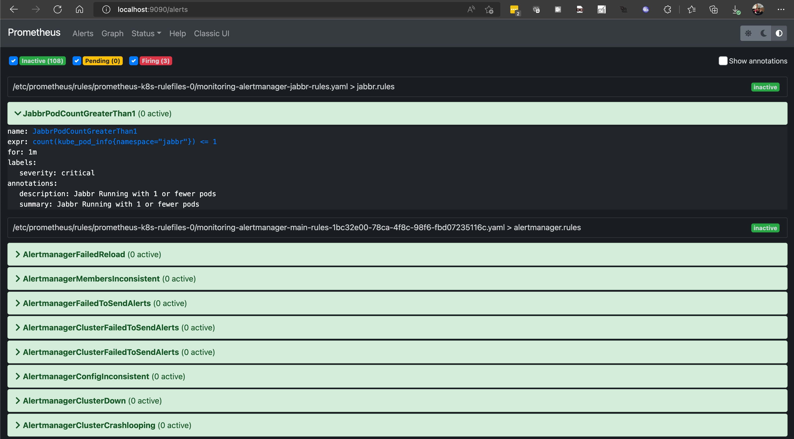

# Lab 2 Part 1: Configure Alerting with Prometheus

In this lab we will configure [Alert Manager](https://prometheus.io/docs/alerting/latest/alertmanager/), which is part of Kube Prometheus, to raise alerts on a given metric.

## Prerequisites

* Complete previous labs:
    * [Create AKS Cluster](../create-aks-cluster/README.md)
    * [Monitoring Setup](./monitoring.md)

## Instructions

Setting up alerting via Alert Manager involves two parts. Part 1 is where we will configure the prometheus rules file to raise the alert on the given metric. Part 2 will involve configuring a notification target. 

Lets get started with the prometheus rule file update.

### Get and edit the existing cluster Prometheus Rules File ConfigMap

Go to the lab folder:
```bash
cd kubernetes-hackfest/labs/windows/labs/monitoring
```

Kube Prometheus comes pre-configured with a number of existing alert rules. You can see this if you connect to the prometheus UI and go to the 'Alerts' tab, as follows:

```bash
# port-forward the prometheus service, if you haven't already exposed it as a service of type 'LoadBalancer'
kubectl port-forward svc/prometheus-k8s -n monitoring 9090:9090
Forwarding from 127.0.0.1:9090 -> 9090
Forwarding from [::1]:9090 -> 9090
```

Navigate to [http://localhost:9090](http://localhost:9090) and click on the 'Alerts' tab.



You can view these alert rules in the configmap named 'prometheus-k8s-rulefiles-0'. Lets get that file locally so we can edit it:

```bash
kubectl get configmap prometheus-k8s-rulefiles-0  -n monitoring -o yaml > prometheus-k8s-rulefiles-0.yaml  
```

There are some additional rules in here that are already firing alerts, for example the rule for the ControlerManager health. We can remove those later, but lets start by adding a new rule.

In the file, add the following to the 'data' block. This rule will check the number of Jabbr pods we have running, and if it's less than or equal to 1 the alert will fire. This alert will be labeled as 'severity: critical', which will be important later.

```yaml
data:
  monitoring-alertmanager-jabbr-rules.yaml: |
    groups:
    - name: jabbr.rules
      rules:
      - alert: JabbrPodCountGreaterThan1
        annotations:
          description: Jabbr Running with 1 or fewer pods
          summary: Jabbr Running with 1 or fewer pods
        expr: |
          # Get the number of jabbr pods running
          count(kube_pod_info{namespace="jabbr"})<=1
        for: 1m
        labels:
          severity: critical 
```

In order to use this file we need to remove some additional content. From the 'metadata' section, remove everythign but the 'name' and 'namespace' fields and then save the file. You can see an example file at [./manifests/prometheus-k8s-rulefiles-0.yaml](./manifests/prometheus-k8s-rulefiles-0.yaml)

### Apply the rules and check the alerts

We can apply the changes with the kubectl 'replace' command. 

```bash
kubectl replace -f ./manifests/prometheus-k8s-rulefiles-0.yaml 
```

Wait for a minute or two for the rule to be loaded and fire and then check the Alerts dashboard again. Notice that the alert is already firing in a 'pending'state and will shortly be in an 'active' state. This is because our rule is checking the number of Jabbr pods we have in our deployment, and right now, unless you've already modified it, you only have 1 jabbr pod. 



Let's resolve the alert. We can do that by scaling our Jabbr deployment up to 2 or more pods.

```bash
kubectl scale deploy jabbr --replicas=2 -n jabbr  
```

Within a few minutes you should see the alert go from yellow or red to green, indicating that it has been resolved.



That's it! You now have a working alert rule in Kube Prometheus. Next we'll work on trigginer an external notification based on this alert.

#### Next Lab: [Alerting Part 2](./alerting-part2.md)